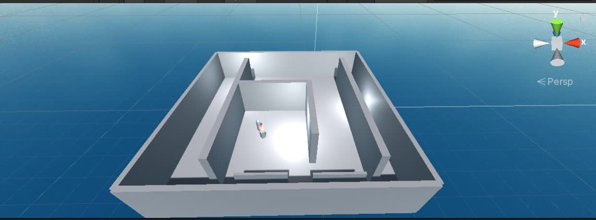
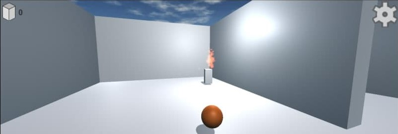
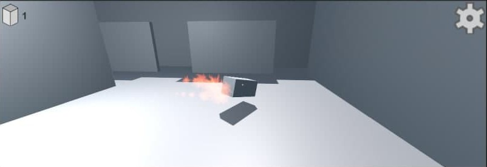
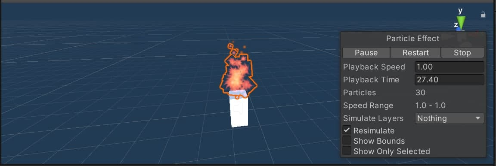
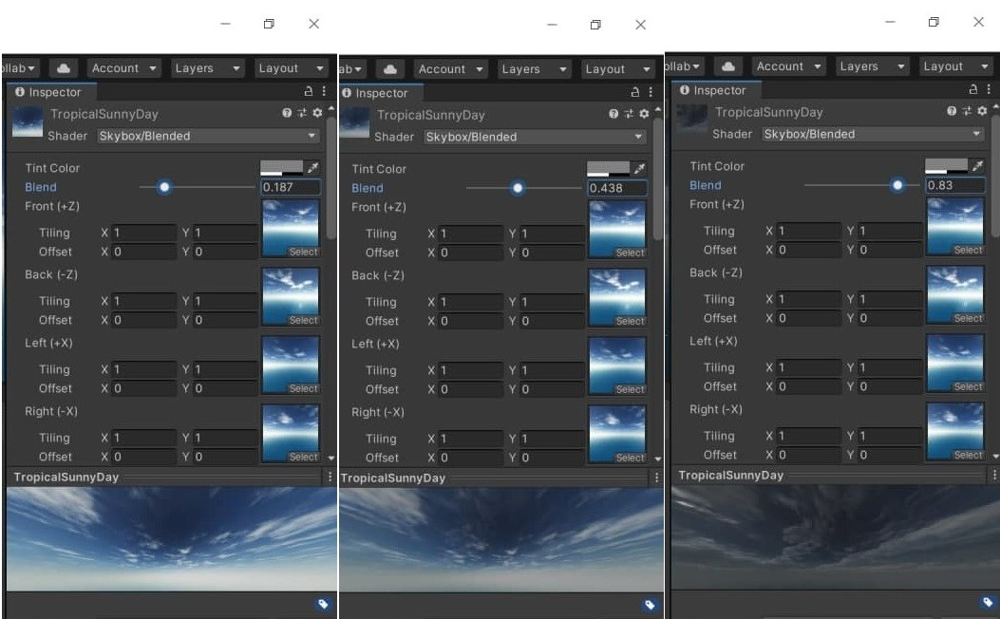
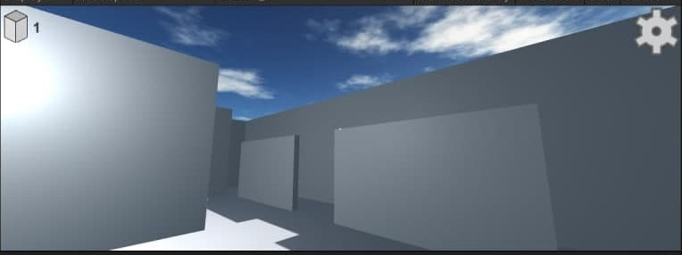
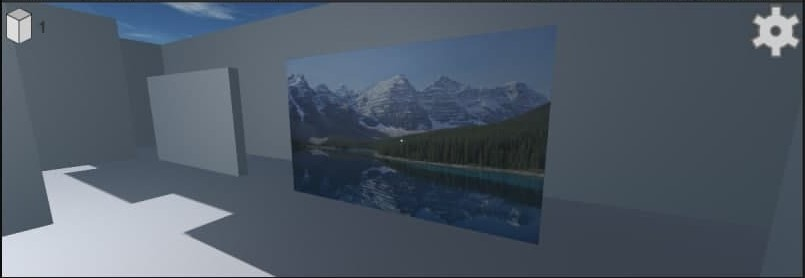
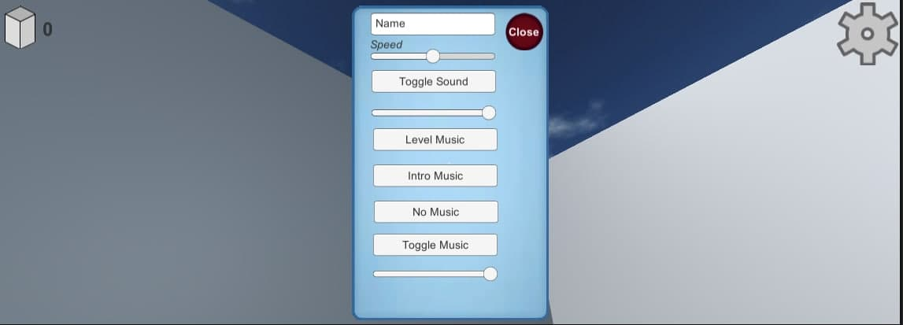

# Тестовое приложение игры (Doom)
* ## Общее описание
Данный проект представляет собой шутер от первого лица в 3D графике, созданный при помощи игрового движка Unity.
> Это тренировочное приложение и не представляет собой полноценную игру!

Цель: убивать врага, гуляющего по сцене.

Общий вид сцены:

 
* ## Особенности реализации
 * ### Враг
 Враг является шаблоном (prefab) и добавляется в игру посредством кода, когда предыдущий враг погибает. Так в сцене всегда присутствует единственный противник. Враг представляет
собой простейший AI, который разворачивается в произвольном направлении, когда видит перед собой препятствие в виде стены,
если напротив него появляется игрок, то враг производит выстрел, чем наносит урон игроку при попадании. 
Игрок также можут производить выстрел по врагу, при попадании враг погибает. 
После смерти врага, в сцене появтяется новый.

Также враг "пылает" за счет использования системы частиц (particle system), имитирующей огонь.

 * ### SkyBox
 SkyBox сцены имеет два состояния, которые переходят друг в друга за счет использования шейдера перехода изображений. Состояние неба зависит от данных о погоде, которые берутся 
 с сайта OpenWeatherMap при помощи запросов к WebAPI.
 > Шейдер был взят из открытых источников (http://wiki.unity3d.com/
index.php?title=SkyboxBlended).

 * ### Загрузка изображений из интернета
 В сцене имеется объект-щиток: когда игрок подходит к нему и нажимает левый Shift, происходит загрузка изображения из интернета, которое отображается как материал объекта.
 
 
 
 
 * ### GUI и аудио
 В игре ведется счет поверженным врагам, а также имеется всплывающее меню, которое отвечает за регулировку скорости врага и за звуки и музыку в игре.
 
 Аудио-система включает в себя:
 * Звук выстрела, попадания во врага и промаха;
 * Звук горящего противника;
 * Фоновоую музыку, которая состоит из двух треков, которые игрок может переключать.
Громкость фоновой музыки регулируется отдельно от громкости звуков.

